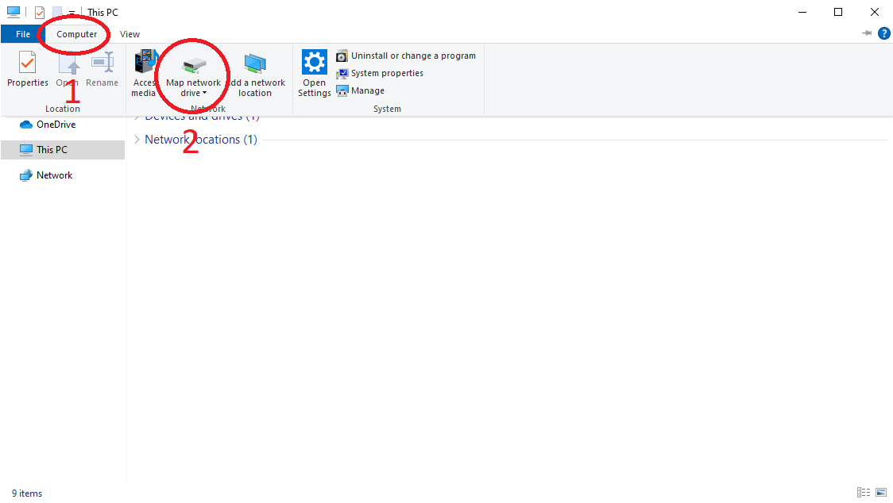
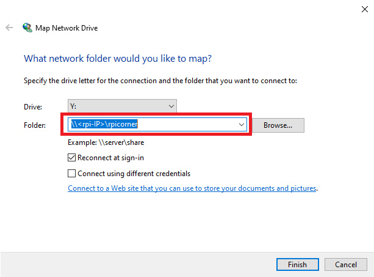
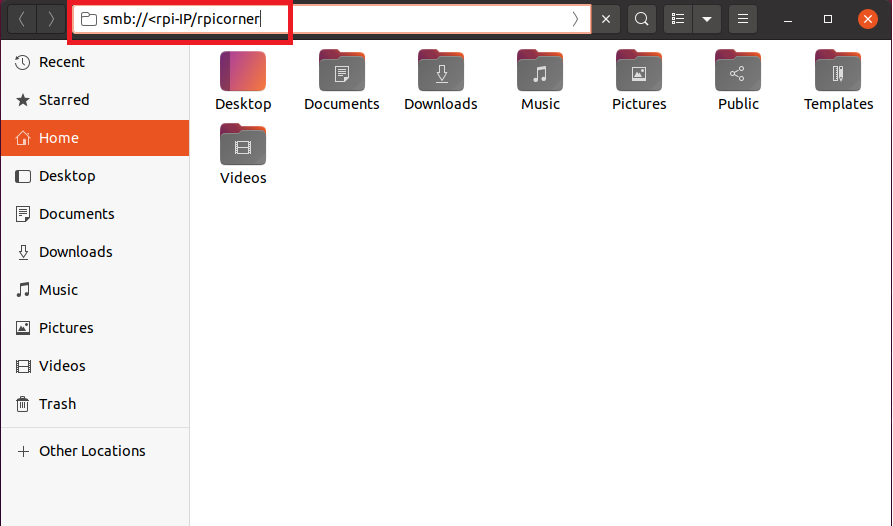

# How to Setup a Samba Server on the Raspberry Pi

Samba is a re-implementation of the SMB (Server Message Block) networking protocol and allows Linux computers to integrate into Microsoft’s active directory environments seamlessly.
By using Samba on our Raspberry Pi, we can easily share directories in a way that they can be accessed on almost every operating system.

Samba is one of the easiest file servers to set up and configure, which makes it perfect for a beginers project at the same time beeing very useful to share files on your home network,
specially when you intend on targeting Windows systems.

# Equipment

Below is the equipment you need to follow this tutorial:

## Recommended

- [Raspberry PI](https://bit.ly/36T6lqL)
- [Micro SD Card](https://amzn.to/2JBK4Fd) 4GB is the bare minimum, but the bigger the card more files can be shared.

## Optional
The first thing that we must do before we
- [External Hard Drive](https://amzn.to/37JL1mS) For reliable data storage (SDCards tend to fail after a while due to enourmous amount of operations the OS need to do)
- [Raspberry PI Case w/ Fan](https://amzn.to/2VSi16N) For cooling the board to prevent over temperatures and performance throttle

Note: The USB ports on the Raspberry Pi might not be enough to power an external drive so you might need to invest in a [powered USB hub](https://amzn.to/3ovA27h).

# Before start

To follow this tutorial you just need to have access to a terminal on the Raspberry Pi, it can be directly plug a keyboard, mouse and monitor or just access it remotly via SSH.
This tutorial was developed and tested on the Raspberry PI OS, but any linux distribution that runs on the Raspberry Pi should work.

# Setting up Samba

The first thing that we must do before we we proceed is to make sure everything is up to date.

```
sudo apt update && sudo apt upgrade -y
```

Now that we have our operating system up to date, we can now proceed to installing the Samba software to our Raspberry Pi. Since Samba is very popular it is already present on most distributions software repositories.
On the Raspberry Pi OS is as simple as running the following command:

```
sudo apt install -y samba samba-common-bin
```

With the software installed we need to setup a folder that will be shared among the network.

Create a folder in the PI home folder like the following:

```
mkdir /home/pi/share
```

Note: If you want to use the hard drive to store your data check the **Hard drive access tutorial**.

The folder to share is ready. Now you need to configure samba to expose the created folder to the network. To do that open the smb.conf with the command:

```
sudo nano /etc/samba/smb.conf
```

Within this file, add the following to the bottom:

```
[rpicorner]
path = /home/pi/share
read only = No
create mask = 0777
directory mask = 0777
guest only = Yes
guest ok = Yes
```

- **[rpicorner]** - This defines the share itself, the text between the brackets is the point at which you will access the share. 
- **path** - This option is the path to the directory on your Raspberry Pi that you want to share. In this example the folder created previously. 
- **read only** - This option defines if the clients on the network can only read the files. 
- **create mask** and **directory mask** - This option defines the maximum permissions for both files and folders. Setting this to 0777 allows users to read, write, and execute. 
- **guest only** and **guest ok** - This option makes the folder acessible without any authentication.

With the changes made to the file, you can now go ahead and save it by pressing **CTRL + X** then **Y** followed by **ENTER**.

At this point the samba service is configured. To make the changes available you must restart the service with the command:

```
sudo systemctl restart smbd
```

To connect other computers to the new shared folder we need to know the IP address of the Raspberry PI. To do that you can run:

```
hostname -I
```

Now you are ready to connect to the shared folder.

# Connecting to the samba server from a Windows machine
To connect to your Samba on Windows, begin by opening up the **File Explorer**.

Within the “File Explorer” click the **Computer** tab (1.) then click **Map network drive** (2.)



Then fill the dialog box that appeared with the Raspberry PI IP and the share name defined early. Example in image below:



Click **finish** and a window with your shared folder should appear. Enjoy quick and easy file share between computers in your network!

# Connecting to the samba server from a Ubuntu machine

To connect to your Samba on Ubuntu, open the **File Explorer** and press **CTRL + L**.
Then fill the dialog box that appeared with the Raspberry PI IP and the share name defined early. Example in image below:



Press **ENTER** and a window with your shared folder should appear. Enjoy quick and easy file share between computers in your network!
